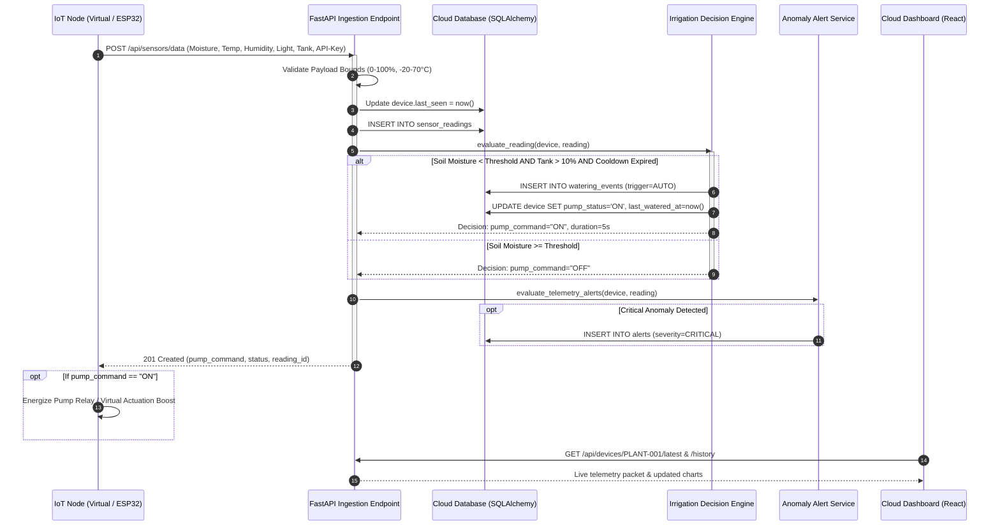

# System Architecture & Technical Specifications

## 1. High-Level Architectural Diagram

```text
+-----------------------------------------------------------------------------------+
|                            EDGE / PERCEPTION LAYER                                |
|                                                                                   |
|   +------------------------------------+   +----------------------------------+   |
|   |    Python Virtual IoT Simulator    |   |    Physical ESP32 Edge Node      |   |
|   |  - Soil Physics Simulation Engine  |   |  - Capacitive Soil Sensor v1.2   |   |
|   |  - Diurnal Microclimate Generator  |   |  - DHT22 Temp/Humidity Sensor    |   |
|   |  - Virtual Pump Actuation Feedback |   |  - 5V Optoisolated Relay Module  |   |
|   +-----------------+------------------+   +-----------------+----------------+   |
+---------------------|----------------------------------------|--------------------+
                      |                                        |
                      | HTTPS / REST (JSON + API Key)          |
                      v                                        v
+-----------------------------------------------------------------------------------+
|                        CLOUD INGESTION & GATEWAY LAYER                            |
|                                                                                   |
|                 +--------------------------------------------+                    |
|                 |          FastAPI Reverse Proxy             |                    |
|                 |  - TLS / HTTPS Termination                 |                    |
|                 |  - Device Identity & API Key Auth          |                    |
|                 |  - Pydantic Ingestion Contract Validation  |                    |
|                 |  - CORS Policy Engine                      |                    |
|                 +---------------------+----------------------+                    |
+---------------------------------------|-------------------------------------------+
                                        |
                                        v
+-----------------------------------------------------------------------------------+
|                     CLOUD COMPUTING & AUTOMATION CORE                             |
|                                                                                   |
|   +---------------------------+             +---------------------------------+   |
|   |  Automated Watering       |             |  Heartbeat & Anomaly Alert      |   |
|   |  Decision Engine          |             |  Service                        |   |
|   |  - Hysteresis Logic       |             |  - Offline Node Detection       |   |
|   |  - Cooldown Enforcement   |             |  - Critical Moisture Alerts     |   |
|   |  - Reservoir Protection   |             |  - Heat Stress Watchdog         |   |
|   |  - Plant Profiles         |             |  - Severity Categorization      |   |
|   +-------------+-------------+             +----------------+----------------+   |
+-----------------|--------------------------------------------|--------------------+
                  |                                            |
                  v                                            v
+-----------------------------------------------------------------------------------+
|                         PERSISTENCE & STORAGE LAYER                               |
|                                                                                   |
|   +---------------------------------------------------------------------------+   |
|   |                     SQLAlchemy ORM Data Engine                            |   |
|   |  - SQLite (Local Dev) / PostgreSQL / Supabase / AWS RDS (Cloud Production)|   |
|   |  - Tables: users, devices, sensor_readings, watering_events, alerts       |   |
|   |  - Optimized B-Tree Indexes on device_id and timestamp                    |   |
|   +---------------------------------------------------------------------------+   |
+-----------------------------------------------------------------------------------+
                                        |
                                        v
+-----------------------------------------------------------------------------------+
|                         PRESENTATION & CONTROL LAYER                              |
|                                                                                   |
|   +------------------------------------+   +----------------------------------+   |
|   |    React + Vite Web Dashboard      |   |   Embedded High-Performance UI   |   |
|   |  - Live Status Cards & Gauges      |   |  - Chart.js Dynamic Visualizer   |   |
|   |  - Real-Time Time-Series Charts    |   |  - Instant Manual Pump Actuator  |   |
|   |  - Botanical Preset Selectors      |   |  - Threshold Sliders             |   |
|   |  - Watering Audit Log & KPIs       |   |  - Interactive Swagger OpenAPI   |   |
|   +------------------------------------+   +----------------------------------+   |
+-----------------------------------------------------------------------------------+
```

---

## 2. Telemetry Ingestion Flow Sequence



---

## 3. Database Schema & Indexing Architecture

### `users`
- `user_id` (VARCHAR(64), PK): Unique user identifier.
- `name` (VARCHAR(100)): Gardener full name.
- `email` (VARCHAR(120), UNIQUE, INDEX): Contact email.
- `created_at` (DATETIME): Account registration timestamp.

### `devices`
- `device_id` (VARCHAR(64), PK, INDEX): Unique hardware MAC or virtual ID.
- `user_id` (VARCHAR(64), FK -> users.user_id): Owner relation.
- `plant_name` (VARCHAR(100)): Friendly plant nickname.
- `plant_type` (VARCHAR(50)): Species category (`TOMATO`, `SUCCULENT`, `HERB`, `INDOOR PLANT`, `TROPICAL`, `BONSAI`).
- `location` (VARCHAR(100)): Physical growing location.
- `moisture_threshold` (FLOAT): Soil moisture trigger level.
- `auto_water_enabled` (BOOLEAN): Cloud irrigation toggle.
- `pump_status` (VARCHAR(10)): `ON` or `OFF`.
- `last_seen` (DATETIME, INDEX): Heartbeat timestamp for offline detection.
- `last_watered_at` (DATETIME): Last irrigation timestamp.

### `sensor_readings`
- `reading_id` (INTEGER, PK, AUTO_INCREMENT): Sequential record ID.
- `device_id` (VARCHAR(64), FK -> devices.device_id, INDEX): Associated node.
- `soil_moisture` (FLOAT): 0.0 - 100.0%.
- `temperature` (FLOAT): Ambient °C.
- `humidity` (FLOAT): Relative air moisture %.
- `light_level` (FLOAT): Light exposure %.
- `water_tank_level` (FLOAT): Reservoir capacity %.
- `timestamp` (DATETIME, INDEX): Time-series partition point.

### `watering_events`
- `event_id` (VARCHAR(64), PK): Unique event UUID.
- `device_id` (VARCHAR(64), FK -> devices.device_id, INDEX): Target plant.
- `trigger_type` (VARCHAR(20)): `AUTOMATIC` or `MANUAL`.
- `moisture_before` (FLOAT): Moisture prior to cycle.
- `moisture_after` (FLOAT, NULLABLE): Post-irrigation moisture.
- `duration_seconds` (INTEGER): Pump run time.
- `timestamp` (DATETIME, INDEX): Audit event timestamp.

### `alerts`
- `alert_id` (VARCHAR(64), PK): Unique alert UUID.
- `device_id` (VARCHAR(64), FK -> devices.device_id, INDEX): Originating node.
- `alert_type` (VARCHAR(50)): `LOW_SOIL_MOISTURE`, `HIGH_TEMPERATURE`, `LOW_WATER_TANK`, `DEVICE_OFFLINE`.
- `severity` (VARCHAR(20)): `INFO`, `WARNING`, `CRITICAL`.
- `message` (TEXT): Notification message.
- `status` (VARCHAR(20)): `ACTIVE`, `ACKNOWLEDGED`, `RESOLVED`.
- `created_at` (DATETIME, INDEX): Trigger timestamp.
